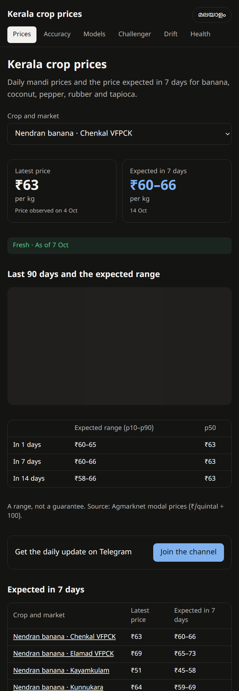
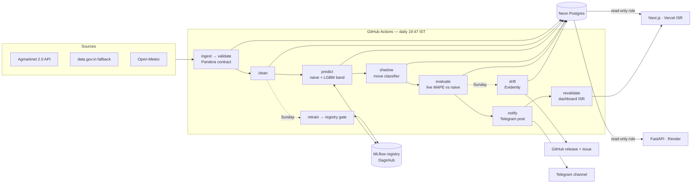

# cropcast — Kerala crop price forecaster

[](https://github.com/sayandp/kerala-crop-forecaster/actions/workflows/daily_pipeline.yml)
[](https://github.com/sayandp/kerala-crop-forecaster/actions/workflows/ci.yml)
[](https://kerala-crop-forecaster.vercel.app/accuracy)
[](https://kerala-crop-forecaster.vercel.app/health)

A self-retraining MLOps system for daily mandi prices of five Kerala crops: Nendran banana,
coconut, black pepper, rubber RSS-4 and tapioca. It runs every evening on free tiers (₹0). It
publishes today's price and the range expected in 7 days, in Malayalam first, on a dashboard,
an API and a Telegram channel.

**[Dashboard](https://kerala-crop-forecaster.vercel.app)** ·
**[API docs](https://cropcast-api.onrender.com/docs)** ·
**[Telegram channel](https://t.me/)** ·
**[MLflow on DagsHub](https://dagshub.com/sayandp/kerala-crop-forecaster.mlflow)** ·
**[Phase 2.5 report](reports/phase2_5_signal_hunt.md)** ·
**[Pre-registration](reports/preregistration_e4a.md)**



## Key findings

- **"Last price" is hard to beat.** Over a 52-fold walk-forward test (about 2 years, 11,579
  forecasts at h = 7), LightGBM scored 5.13 % MAPE against 5.11 % for naive (DM p = 0.75). Adding
  arrivals, Tamil Nadu and Karnataka markets, or per-series blends did not help. So the
  **published forecast is naive**, and LightGBM quantiles only supply the p10–p90 band.
- **Pepper is where models do harm.** LightGBM was significantly *worse* than naive for pepper
  (−6.3 %, p = 0.009).
- **The `market` feature was memorisation.** Removing it gave exactly naive's error, and feature
  importance moved to volatility.
- **The one robust signal is the direction of large (> 3 %) weekly moves.** Macro-F1 was 0.52,
  against 0.24 for always-flat and 0.41 for trend persistence. It now runs **in shadow** under a
  [pre-registered](reports/preregistration_e4a.md) live test and is never shown to users until
  it passes.
- **Drift is the normal state.** The first weekly Evidently report flagged 74 % of model inputs
  (lags and rolling statistics of a seasonal price), with no drift in weekly price changes
  (p = 0.12). The escalation rule fires and is tracked in an open issue, not hidden.

## Architecture



- **Batch serving, not online inference.** Forecasts are written to Postgres each night.
- **Read-only serving.** The API and the dashboard connect as `cropcast_ro` (SELECT only).
- **Honest promotion.** A challenger replaces the champion only with at least 3 % lower MAPE
  **and** a Diebold–Mariano p < 0.05. Every decision is logged in `promotion_log` and shown on
  [/models](https://kerala-crop-forecaster.vercel.app/models).

## Serving

| | Where | Notes |
|---|---|---|
| API | Render free (Singapore), `docker/api.Dockerfile` | `/health /crops /markets /forecast /history /metrics /badge/*.json`. 10-min cache, 60 req/min/IP. Image 186 MB; `/health` answers 0.8 s after start at 512 MB. |
| Dashboard | Vercel Hobby, `web/` | Next.js App Router, Malayalam at `/`, English at `/en`. ISR hourly, plus `POST /api/revalidate` after each daily run. Lighthouse mobile on `/`: performance 93–94, accessibility 100, SEO 100. |
| Telegram | one public channel | Daily post: latest ₹/kg and the 7-day p10–p90 per crop. Stale (> 3 days) and implausible markets are left out. |
| Drift | GitHub releases `reports-<date>` | Weekly Evidently HTML; summary in `drift_reports`. |

## Quickstart

```bash
uv sync
cp .env.example .env                                   # fill in secrets
docker compose -f docker/docker-compose.yml up -d      # or: .\scripts\pg_local.ps1 start
uv run python -m cropcast.pipeline --steps ingest,validate,weather --dry-run
uv run pytest -q
uv run uvicorn cropcast.api.main:app --reload          # API on :8000 (needs DATABASE_URL_RO)

cd web && npx -y pnpm@12.9.1 install && npx -y pnpm@12.9.1 dev   # dashboard on :3000
```

**Neon is the source of truth.** The `DATABASE_URL` GitHub secret points to it, and the daily job
writes there. The local Postgres (`D:\pg`, `scripts/pg_local.ps1`) is for development only.

## Data sources

| Data | Source | Notes |
|---|---|---|
| Daily mandi prices | Agmarknet 2.0 report API (fallback: data.gov.in daily resource) | The last 3 days are re-pulled to catch late reports. |
| History 2018→ | Agmarknet 2.0 date-wise prices | `scripts/backfill.py`, cached and checkpointed. |
| Weather | Open-Meteo | District HQ coordinates in `src/cropcast/ingest/districts.yaml`. |

- **Units.** Prices are ₹/quintal; ₹/kg = ÷ 100. Per-crop plausibility bands live in
  `config/units.yaml`.
- **Polite requests.** Calls are rate-limited to 2 s per host, retried 3× with backoff, and
  cached in `data/cache/`.
- **Archive.** Rows older than 90 days in `prices_raw` move monthly to verified GitHub Releases.

## GitHub secrets

| Secret | Used by |
|---|---|
| `DATABASE_URL` | daily pipeline (Neon, read-write) |
| `DATABASE_URL_RO` | read-only role (reference copy; the API reads it on Render, the dashboard on Vercel) |
| `MLFLOW_TRACKING_URI`, `MLFLOW_TRACKING_USERNAME`, `MLFLOW_TRACKING_PASSWORD` | retrain, predict, shadow (DagsHub) |
| `TELEGRAM_BOT_TOKEN`, `TELEGRAM_CHANNEL_ID`, `TELEGRAM_ADMIN_CHAT_ID` | channel post, admin alerts (without them: dry-run logs) |
| `VERCEL_REVALIDATE_URL`, `REVALIDATE_SECRET` | `revalidate` step (warning only if missing or failing) |
| `RENDER_DEPLOY_HOOK` | `deploy.yml` after CI passes on main |
| `DATAGOV_API_KEY` | data.gov.in fallback (optional) |

## Monitoring the API (UptimeRobot)

1. Add a free **HTTP(s)** monitor on `https://cropcast-api.onrender.com/health` at a 10-minute
   interval.
2. Use keyword `"db_ok":true`, or just the status: `/health` returns 503 when Neon is unreachable.
3. Alert contact: your email or Telegram.

A 10-minute ping keeps the free instance awake (744 h/month fits the 750 free instance-hours).
Otherwise expect a 30–60 s wake-up on the first request after Render's free instance has slept; the
dashboard does not depend on the API.

See [`CLAUDE.md`](CLAUDE.md) for the full design rules.
